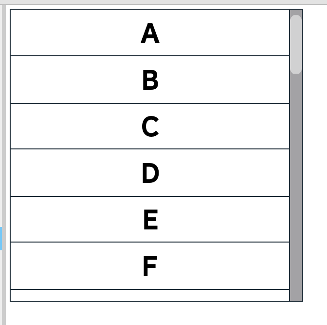
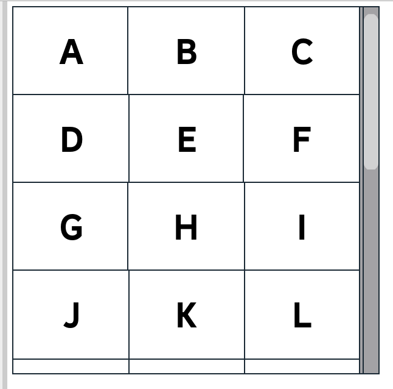

# Introduction
UltimateList is a library for creating fast and efficient virtualized lists in Roblox. A virtualized list is a scrolling frame that only creates elements for items that can actually be seen. This puts less work on the engine, defers running code in React components until they can be seen (as well as cleaning up when they're not), and in some cases can do this while also performing zero React re-renders as a user interacts with the list.

<video controls style={{
    width: "100%",
    maxWidth: "800px",
}}>
    <source src={require("@site/static/example_virtualized.mp4").default} type="video/mp4" />
</video>

UltimateList supports:
- Arbitrarily sized and positioned elements, so it is just as easy to create a list as it is a grid.
    - Extra optimizations are provided for lists with elements of consistent sizes.
- Rendering elements through simple state, or allowing for the use of bindings to avoid re-renders while scrolling.
- Strictly typed Luau.

## Examples

A basic list can be made with the following code:
```lua
local letters = {}
for offset = 0, 25 do
    table.insert(letters, string.char(string.byte("A") + offset))
end

return React.createElement("Frame", {
    Size = UDim2.fromOffset(300, 300),
}, {
    ScrollingFrame = React.createElement(UltimateList.Components.ScrollingFrame, {
        dataSource = UltimateList.DataSources.array(letters),

        dimensions = UltimateList.Dimensions.consistentSize(48),

        renderer = UltimateList.Renderers.byState(function(value)
            return React.createElement("TextLabel", {
                BackgroundColor3 = Color3.new(1, 1, 1),
                Font = Enum.Font.BuilderSansBold,
                Text = value,
                TextColor3 = Color3.new(0, 0, 0),
                TextSize = 36,
                Size = UDim2.fromScale(1, 1),
            })
        end),

        direction = "y",
    }),
})
```



Want a grid instead? Just change your [dimensions](./core-concepts/dimensions).
```lua
local letters = {}
for offset = 0, 25 do
    table.insert(letters, string.char(string.byte("A") + offset))
end

return React.createElement("Frame", {
    Size = UDim2.fromOffset(300, 300),
}, {
    ScrollingFrame = React.createElement(UltimateList.Components.ScrollingFrame, {
        dataSource = UltimateList.DataSources.array(letters),
        
        dimensions = UltimateList.Dimensions.consistentUDim2(
            UDim2.new(0.33, 0, 0, 72)
        ),

        renderer = UltimateList.Renderers.byState(function(value)
            return React.createElement("TextLabel", {
                BackgroundColor3 = Color3.new(1, 1, 1),
                Font = Enum.Font.BuilderSansBold,
                Text = value,
                TextColor3 = Color3.new(0, 0, 0),
                TextSize = 36,
                Size = UDim2.fromScale(1, 1),
            })
        end),

        direction = "y",
    }),
})
```



...or even swap for bindings to maximize your performance.

```lua
renderer = UltimateList.Renderers.byBinding(function(valueBinding)
    return React.createElement("TextLabel", {
        BackgroundColor3 = Color3.new(1, 1, 1),
        Font = Enum.Font.BuilderSansBold,
        Text = valueBinding:map(function(value: string?)
            return value or ""
        end),
        TextColor3 = Color3.new(0, 0, 0),
        TextSize = 36,
        Size = UDim2.fromScale(1, 1),
    })
end),
```

## Installation
UltimateList is available on [Wally](https://wally.run/). Add the install command provided by https://wally.run/package/kampfkarren/ultimate-list to your wally.toml.

After doing that, run `wally install`. To make strict typing easier, you may also run [`wally-package-types`](https://github.com/JohnnyMorganz/wally-package-types) to re-export the public types.

UltimateList is built on [React](https://roblox.github.io/roact-alignment/).
